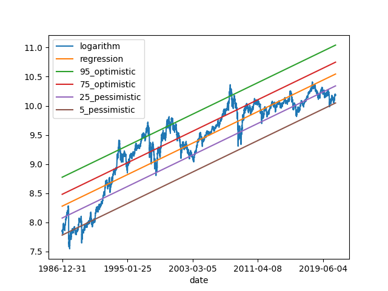

#**Background**

This GIT project is a practice to realize the theory of Tseng's Tunnel

Tseng's Tunnel uses a liner regression to apply on a security or a market index aiming to obtain an indication of emotion of investors at the current price by using Python

#**Dependency**

Please use pip to install below libraries into the environment before execution (e.g.: python3 -m pip install XXXXXX)
1. pandas
2. numpy
3. matplotlib.pyplot
4. scipy.stats

#**Run the program**

\>python3 tsengtunnel/tsengTunnel_main.py

#**Version history**

Version 1 (Feb 1, 2021) - Support command line execution.  Visualize Tseung's tunnel by displaying regression line, logarithm, 95%, 75%, 25%, and 5% lines.  Statis data set in CSV format
